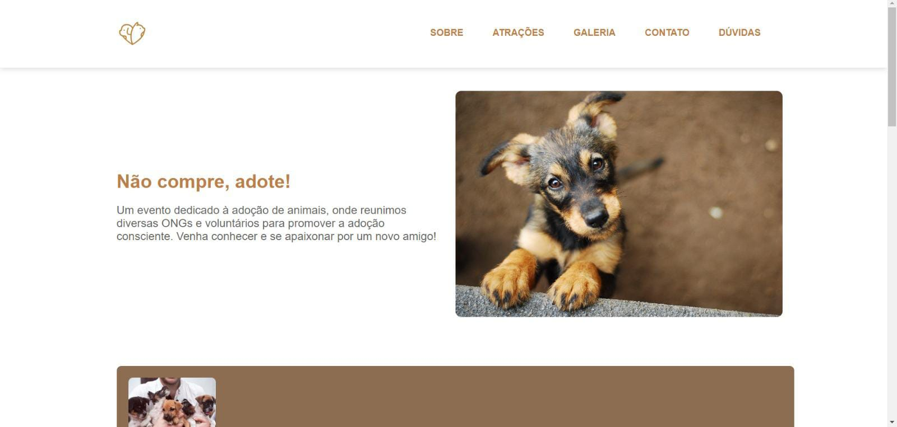

<h1 align="center"> Evento de Adoção de Animais </h1>

Programa exclusivo e gratuito, promovido pelo Juventude Digital para ensino da carreira front-end.  

  

## 🚀 Tecnologias

Esse projeto foi desenvolvido com as seguintes tecnologias:

- HTML e CSS
- JavaScript

## 💻 Projeto

Este site foi criado com o intuito de divulgar um evento de adoção de animais totalmente exclusivo e gratuito.

## 🌟 Considerações finais

Esse curso me ajudou bastante, tanto na prática, como na teórica. Me fez enfrentar dificuldades e superá-las. Sem dúvidas, adquiri conhecimentos maravilhosos!

